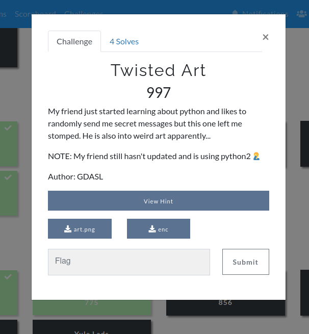
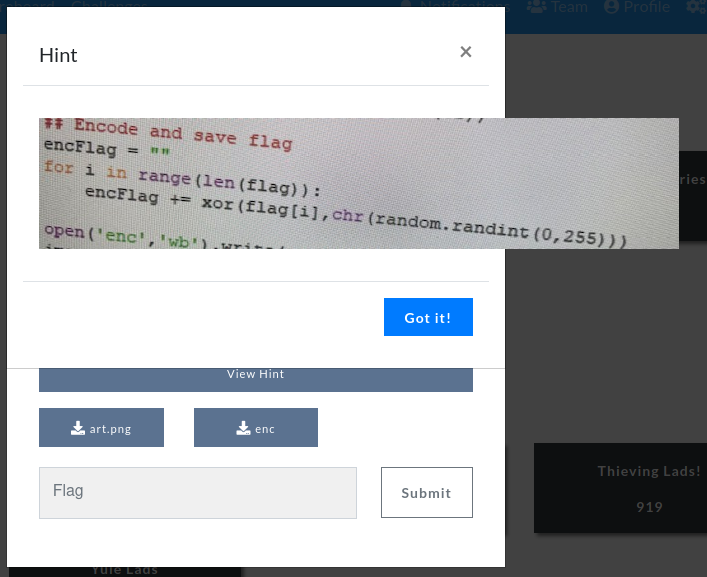
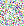
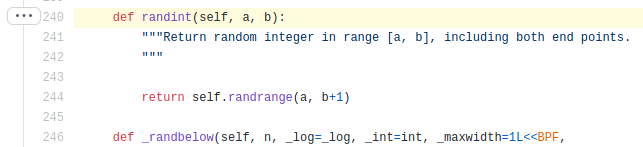
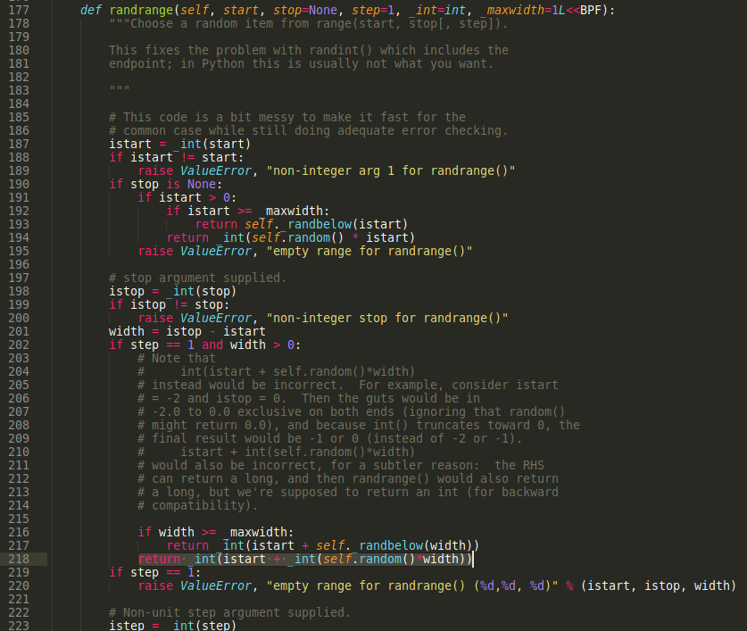
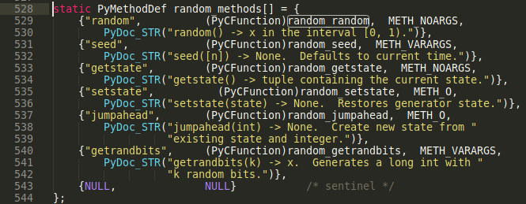
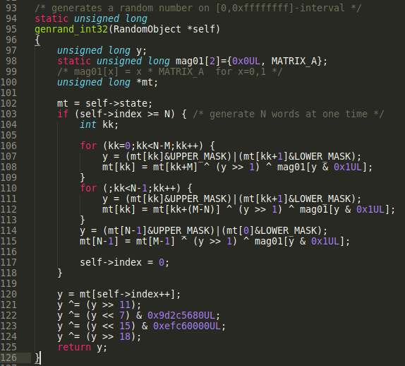

# Twisted Art

Challenge text:



Challenge hint:



art.png:



(I know, the image is very small)

enc:

```
$ xxd enc
00000000: 026e 2cf2 ff14 b920 a1bf 7060 2228 e3e8  .n,.... ..p`"(..
00000010: 056b 8231 53ce 3f99 c594 90              .k.1S.?....
```

## Solution

Solving this challenge requires the knowledge that random numbers in Python can be predicted. Since Python 2.3 the RNG in python's standard library random module is the [MT19937 Mersenne Twister](https://en.wikipedia.org/wiki/Mersenne_Twister). MT19937 passes most tests for statistical randomness but is not cryptographically secure. The internal state of MT19937 consists of 624 32 bit integers which [can be reverse enginnered and cloned](https://cryptopals.com/sets/3/challenges/23) by knowing the last 624 32 bit outputs from the RNG.

From the challenge hint it seems like `enc` contains the encrypted flag which has been encrypted by XOR-ing the plaintext flag with a key that consists of 27 random bytes. We need to know this key to get the flag.

By looking at `art.png` it looks like it's pixels are randomly generated. Let's look at the image's properties:

```
$ file art.png
art.png: PNG image data, 24 x 26, 8-bit/color RGBA, non-interlaced
```

24*26=624 and the challenge name is "Twisted Art" so those are probably hints that the vulnerability of this challenge is the MT19937. Based on that we can guess that the flag was encrypted directly after generating `art.png`. If that's the case, then to to recover the flag we must clone the RNG based on the random numbers in `art.png` and extract 27 `randint(0, 255)` numbers from the clone, this would be the key to decrypt `enc`.

To clone the RNG we need at least 624 32 bit outputs from the underlying MT19937 in the random module. Each pixel in the 24x26 image has 4 values, RGBA which are a byte each. So was each byte generated with `randint(0, 255)` or are the 4 bytes (32 bits) exact outputs from the MT19937 (which are outputs from `random.getrandbytes(32)`)?

Let's look at the [src code](https://www.python.org/downloads/source/) of python2.7 to see how `randint(0, 255)` is calculated:

[Lib/random.py -> randint calls randrange](https://github.com/python/cpython/blob/2.7/Lib/random.py#L240)



[Lib/random.py -> randrange usually calls self.random() (line 218)](https://github.com/python/cpython/blob/2.7/Lib/random.py#L218)


self.random() calls the class's superclass which is a C extension (Modules/_randommodule.c):


random_random calls genrand_int32 twice:


It's those outputs from genrand_int32 that we must feed to a MT19937 cloner.

So for a random.randint(0, 255) value how can we know what the two genrand_int32 values were? This is hard to reverse engineer and likely has multiple answers which make things even harder. So to simplify things for now we can guess that the 4 bytes in RGBA are actually outputs directly from the MT19937, that is outputs from the genrand_int32 function.

But in which order were the pixels generated? We will start by guessing the most natural order for a programmer to do it.

To clone the MT19937 we can use [randcrack.py](https://github.com/tna0y/Python-random-module-cracker). 

After we have cloned the MT19937 we can predict outputs from `genrand_int32` but we want to predict outputs from `randint(0, 255)`. To solve that we write a `predict_randint` function based on the pythnon2.7 src code:

```python
def predict_randint(rc, low, high):
    istart = low
    width = (high + 1) - low

    return int(istart + int(predict_random(rc) * width))


def predict_random(rc):
    """The interface for :py:meth:`random.Random.random` in Python's Standard Library"""
    a = int(rc.predict_getrandbits(32)) >> 5
    b = int(rc.predict_getrandbits(32)) >> 6
    return (a * 67108864.0 + b) * (1.0 / 9007199254740992.0)
```

Now we're ready to implement the full exploit.

decrypt.py:
```python
#!/usr/bin/env pytho2.7
import sys
import struct
import random

# pip install Pillow numpy randcrack
from PIL import Image
import numpy as np
from randcrack import RandCrack


def main():
    image = Image.open("art.png")
    a = np.asarray(image)

    # a.shape = (26, 24, 4) = (H, W, D)
    # a[h, w, d]
    (H, W, D) = (26, 24, 4)

    rands = []
    for h in range(0, H):  # NOTE: which order h first or w?
        for w in range(0, W):
            v = [int(x) for x in a[h][w]]  # NOTE: which order?
            b = struct.pack("<BBBB", *v)  # NOTE: little or big endian?
            x = struct.unpack("<L", b)[0]  # NOTE: little or big endian?
            rands.append(x)
    assert len(rands) == 624

    # Clone Mersenne twister 19937
    rc = RandCrack()
    for r in rands:
        rc.submit(r)

    with open("enc", "rb") as f:
        ciphertext = f.read()

    key_ints = []
    for i in range(0, 27):
        r = predict_randint(rc, 0, 255)
        key_ints.append(r)

    ciphertext_ints = [struct.unpack("<B", c)[0] for c in ciphertext]
    flag_ints = [a ^ b for a, b in zip(ciphertext_ints, key_ints)]
    flag = "".join([chr(x) for x in flag_ints])
    print(flag)


def predict_randint(rc, low, high):
    istart = low
    width = (high + 1) - low

    return int(istart + int(predict_random(rc) * width))


def predict_random(rc):
    """The interface for :py:meth:`random.Random.random` in Python's Standard Library"""
    a = int(rc.predict_getrandbits(32)) >> 5
    b = int(rc.predict_getrandbits(32)) >> 6
    return (a * 67108864.0 + b) * (1.0 / 9007199254740992.0)


if __name__ == "__main__":
    main()
```

We run the code, learn that our assumptions were correct and get the flag:

```
$ python2.7 decrypt.py
IceCTF{b4d_m3rs3nn3_15_b4d}
```
