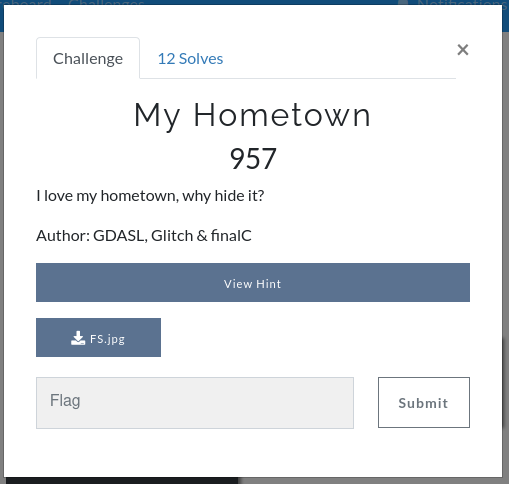
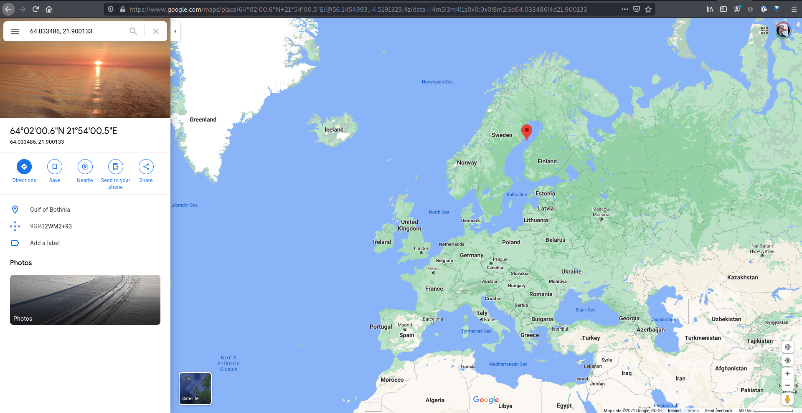
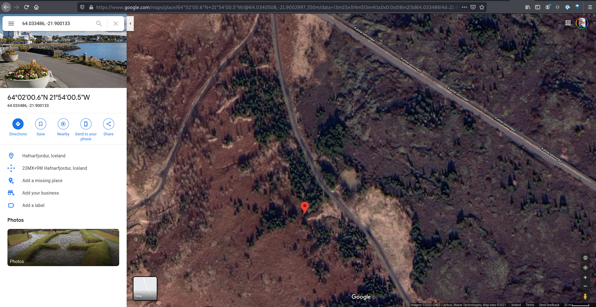

# My Hometown

Challenge text:



Challenge hint:


FS.jpg:


## Solution

Since the only file we have is an image it is likely that this is a steganography challenge and the image contains hidden data.

From the challenge hint we can see the data is likely hidden with [steghide](http://steghide.sourceforge.net/) and that there is a password.

First we try extracting data with empty passphrase:

```bash
$ steghide extract -sf FS.jpg
Enter passphrase:
steghide: could not extract any data with that passphrase!
```

Expectedly it didn't work. This image is a coverphoto for the movie "Eurovision Song Contest: The Story of Fire Saga" of Lars Erickssong (Will Ferrell) and Sigrit Ericksdóttir (Rachel McAdams). Those who have watched that movie know that the hometown of those movie characters is Húsavík. The challenge name is "My Hometown" so we guess the password `husavik`:

```bash
$ steghide extract -sf FS.jpg -p husavik
wrote extracted data to "secret.txt".
```

Success. Let's check the contents of that extracted file:

```bash
$ cat secret.txt
n = 147767851294746620911810388038107728286037238915263678277473972113895902805449170503702649265216615588582242631818941986820754345835910513454492874669403644985033217666215892611622964797736512917384094418165479541796699940155391259232322549057354995706147434748297162590026274856168980580303832087722706212591
c = pow(bytes_to_long(m),3,n)
print(c)
#c = 9448428952703349813814124732128201235470427709314562661132045583634107826039850755974984357425820324294528489575044315496835923369563771423275254177827915965471584296119121991292477991098737327261754002177000
```

This looks like Python code and by Googling that bytes_to_long function it seems like it is from [Crypto.Util.number.bytes_to_long](https://www.kite.com/python/docs/Crypto.Util.number.bytes_to_long). But what does this mean?

There is an undeclared variable `m` in the code which we can guess stands for `message` and we can guess the variable `c` stands for `ciphertext`.

We can see the ciphertext was generated with modular exponentiation of the message. So to decrypt this we must find the cube root of `c` modulo `n`.

```
$ python3
Python 3.9.1rc1 (default, Nov 27 2020, 19:38:39)
[GCC 10.2.0] on linux
Type "help", "copyright", "credits" or "license" for more information.
>>> n = 147767851294746620911810388038107728286037238915263678277473972113895902805449170503702649265216615588582242631818941986820754345835910513454492874669403644985033217666215892611622964797736512917384094418165479541796699940155391259232322549057354995706147434748297162590026274856168980580303832087722706212591
>>> c = 9448428952703349813814124732128201235470427709314562661132045583634107826039850755974984357425820324294528489575044315496835923369563771423275254177827915965471584296119121991292477991098737327261754002177000
>>> m = int((c ** (1.0 / 3)) % n)
>>> m
2114072452918646976678787592456538417769833551259729533428063688196096
>>> from Crypto.Util.number import long_to_bytes
>>> print(long_to_bytes(m))
b'NjQuMC\x8c\x00\x00\x00\x00\x00\x00\x00\x00\x00\x00\x00\x00\x00\x00\x00\x00\x00\x00\x00\x00\x00\x00'
```

These results look giberish, and they are actually, because trying to find the modular cube root of c this way introduces big floating point errors. I used [this](https://stackoverflow.com/a/637321) algorith I found on Stack overflow to calculate `m` with the answer's default accuracy of 27 (x in this algorithm is the c):

```python
from decimal import *

x = "9448428952703349813814124732128201235470427709314562661132045583634107826039850755974984357425820324294528489575044315496835923369563771423275254177827915965471584296119121991292477991098737327261754002177000"

minprec = 27
if len(x) > minprec:
    getcontext().prec = len(x)
else:
    getcontext().prec = minprec

x = Decimal(x)
power = Decimal(1) / Decimal(3)

answer = x ** power
ranswer = answer.quantize(Decimal("1."), rounding=ROUND_UP)

diff = x - ranswer ** Decimal(3)
if diff == Decimal(0):
    print("x is the cubic number of", ranswer)
else:
```

This resulted in a more promising looking value of m:

```
$ python3 calculate_modular_cube_root.py
x is the cubic number of 2114072452918665508166256064801180100116366689192929952901119156779530
```

So this is our value of m, let's try converting it to bytes using the inverse of that bytes_to_long function we saw in secret.txt:

```
$ python3
Python 3.9.1rc1 (default, Nov 27 2020, 19:38:39)
[GCC 10.2.0] on linux
Type "help", "copyright", "credits" or "license" for more information.
>>> m = 2114072452918665508166256064801180100116366689192929952901119156779530
>>> from Crypto.Util.number import long_to_bytes
>>> long_to_bytes(m)
b'NjQuMDMzNDg2IDsgMjEuOTAwMTMz\n'
```

This looks like Base64 encoded data ending with a newline character. So let's decode it:

```bash
$ echo NjQuMDMzNDg2IDsgMjEuOTAwMTMz | base64 -d
64.033486 ; 21.900133
```

This looks like decimal GPS coordinates, so let's look them up in Google Maps:



The point is in the Gulf of Botnica which doesn't seem conected to the challenge's context in any strong way.

The point is though, on the same latitude degree as the southern part of Iceland and this CTF is organized by Icelanders so let's try looking up 64.033486, -21.900133 instead:



This point is just outside a road in "Sléttuhlíd Hafnarfjördur" which is just outside the capital area. So could it be that the next clue is physically hidden at that place? At this point in the competition I was located in Vestmannaeyjar and my team mate in 4 hour drive from that place so we could not check. My friend Tryggvi who lives nearby was however willing to go and check so he was recruited to the team. At the coordinates Tryggvi found this:


Tryggvi was able to read this funky looking QR code with his Google Pixel phone which finally revealed the challenge flag: `IceCTF{look_at_all_these_christmas_trees}`
